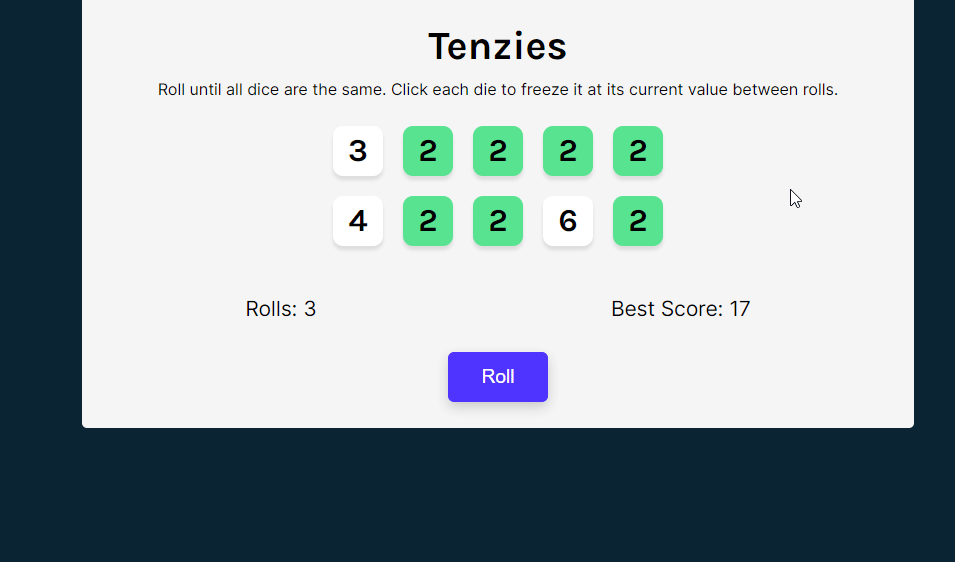

  
  <h1></h1>
  
  <h3>Roll until all dice are the same</h3>

<a href="https://nedimperva.github.io/react-tenzies/"><h3>Try me!</h3></a>

# Description

Tenzi is a dice game used to demonstrate the use of React Hooks (useState, useEffect).

The player needs to roll dice until they are all the same. Clicking on a dice, freezes it at its current value between rolls.

Best scores are saved to local storage.
